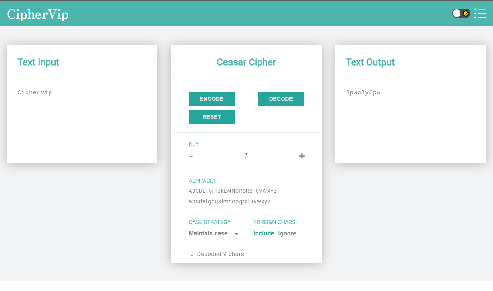

# CipherVip Application

## About

Ciphervip is a web application that provides modules for encrypting and decrypting common ciphers. In addition, CipherVip has utilities such as calculate modulo and modular inverse.

The API is built using Flask and deployed on Heroku. This Flask API is used to receive data from encryption and decryption. The input is sent as a POST request to the API to return the output.

React JS is used to build the user interface part of the web application. Use UI builder JS packages like react-redux, react-i18next and react-router-dom.

Link demo: https://ciphervip.herokuapp.com/



## Description

### Install Back-End Requirements

```
$ pip install -r requirements.txt
```

### Install Front-End Requirements

```
$ cd client
$ npm install
```

### Create venv in local

```
$ python -m venv venv
```

### Run application in local with virtualenv

```
$ venv\Scripts\activate
```

### Run back-end

```
$ py app.py
```

### Run front-end

```
$ cd client
$ npm start
```

### Run

Open your browser to http://localhost:3000

## References

- Theme: http://archives.materializecss.com/0.100.2/color.html
- Layout: https://cryptii.com/
- Tutorial: https://www.youtube.com/watch?v=h0zOsZLPvJY&t=1376s
